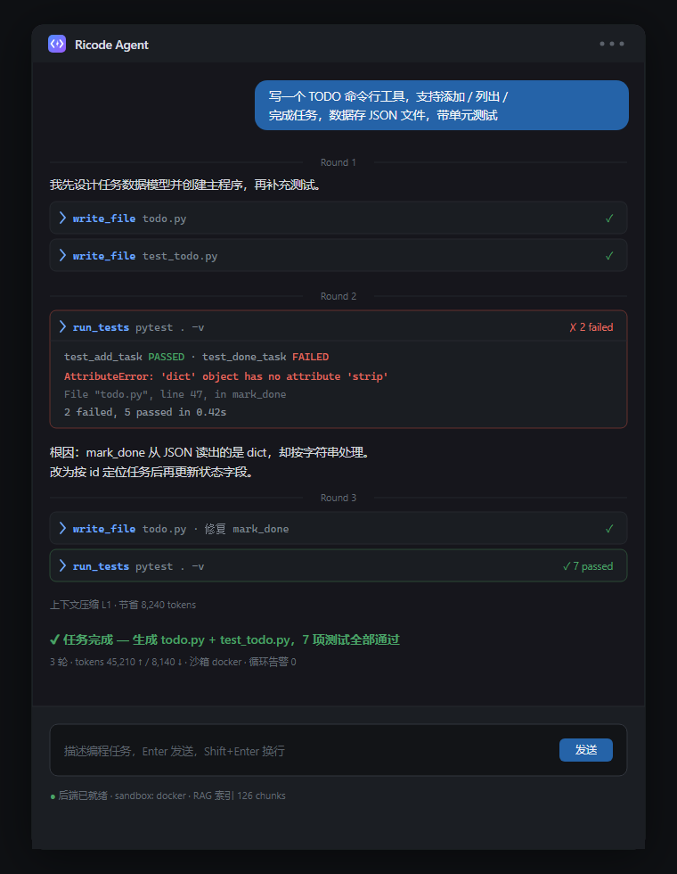

<div align="center">


# Ricode Agent

**自主编程 Agent —— 从任务描述到测试通过，全程无人干预**

[](https://www.python.org/)
[](https://www.typescriptlang.org/)
[](https://fastapi.tiangolo.com/)
[](https://www.docker.com/)



</div>

---

## ✨ 这是什么

Ricode Agent 是一个**类 Claude Code 的自主编程 Agent**：你只需用自然语言描述任务，它会自主完成「规划 → 写码 → 执行 → 看报错 → 修复 → 跑测试」的完整闭环，直到测试全部通过。

不依赖 LangChain 等重型框架——**Agent 核心机制全部自研**，包括多轮工具调用循环、四层上下文压缩、死循环熔断、沙箱执行与代码检索，每一个模块都可以独立替换和调试。

## 🔥 核心特性

### 🧠 自研 ReAct Agent Loop
- 基于 Function Calling 的多轮「推理 → 工具调用 → 观察」循环，最多 50 轮自主迭代
- 7 个内置工具：`write_file` / `read_file` / `execute_python` / `run_command` / `run_tests` / `search_code` / `task_complete`
- `task_complete` 终止信号 + `finish_reason` 组合判断，边界情况显式处理

### 🗜 四层上下文压缩（L1–L4）
长任务不会撑爆 200k 上下文窗口，按 token 水位分级触发：

| 层级 | 水位 | 策略 | 损失 |
|---|---|---|---|
| L1 | 60% | 大 tool_result 持久化到磁盘，留引用 | 低 |
| L2 | 75% | 删除 thinking / reasoning 字段 | 近零 |
| L3 | 85% | LLM 逐轮摘要早期历史 | 可控 |
| L4 | 95% | 单轮溢出兜底，5 步递进清理 | 保底 |

### 🔁 死循环检测与分级熔断
- Trigram N-gram 相似度 + 工具调用指纹双重判据
- 三级响应：**告警注入**（3 轮）→ **强制换策略**（5 轮）→ **熔断退出**（8 轮）

### 🐳 Docker 沙箱隔离
- `--network none` 完全断网 / 内存、CPU、PID 限额 / 只读根文件系统
- 可插拔设计：`BaseExecutor` 接口下 `LocalExecutor` 与 `DockerExecutor` 自由切换，Docker 不可用自动降级

### 🔍 RAG 代码检索
- 滑动窗口代码分块（保留路径 + 行号）+ Embedding 向量化
- **FAISS** 索引加速，未安装时 numpy 余弦相似度兜底
- 磁盘缓存 + 文件 mtime 指纹，仓库变更自动增量重建
- 大仓库场景下 Agent 用 `search_code` 语义定位相关片段，无需通读全部源码

### 🧩 VS Code 扩展
- 编辑器右上角一键唤起对话式面板，打字框固定底部、工具调用卡片式折叠、失败自动展开
- **SSE 流式渲染**：轮次、推理、工具结果实时推送
- 插件激活时自动拉起后端，关闭 VS Code 自动回收

## 🚀 快速开始

### 安装

```bash
git clone <your-repo-url>
cd autonomous-coding-agent
pip install -r requirements.txt
```

### 配置

项目根目录创建 `.env`：

```bash
ANTHROPIC_API_KEY=你的key
ANTHROPIC_BASE_URL=中转地址          # 可选
ANTHROPIC_MODEL=claude-sonnet-5      # 可选

SANDBOX_BACKEND=docker               # 可选：docker / local（默认 local）

# 可选：启用 RAG 代码检索（search_code 工具）
EMBEDDING_BASE_URL=https://api.openai.com/v1
EMBEDDING_API_KEY=你的key
EMBEDDING_MODEL=text-embedding-3-small
```

### 三种用法

**① CLI**
```bash
python main.py "用 Python 写一个 CSV 解析器，支持多种编码，带单元测试"
```

**② Streamlit Web UI**
```bash
streamlit run app.py
```

**③ VS Code 插件（推荐）**
```bash
# 安装插件（一次）
cd vscode-extension && npm install && npm run compile
npx vsce package --allow-missing-repository
code --install-extension autonomous-coding-agent-0.1.0.vsix --force
```
重启 VS Code → 点编辑器右上角 ✦ 图标 → 输入任务。后端由插件自动拉起。

生成物默认输出到 `.agent_workspace/`。

## 🛠 技术栈

**Agent 核心**：Python · Function Calling · ReAct Loop · tiktoken · httpx（流式）
**检索**：RAG · FAISS / numpy · OpenAI-compatible Embeddings
**执行**：Docker 沙箱（网络/内存/CPU/进程隔离）· subprocess
**服务**：FastAPI · SSE · Pydantic
**客户端**：VS Code Extension（TypeScript）· Streamlit · argparse CLI

## 📁 项目结构

```
├── agent/                  # Agent 核心
│   ├── loop.py             #   主循环（ReAct + 事件协议）
│   ├── tools.py            #   工具定义与分发
│   ├── context_compressor.py  # 四层上下文压缩
│   ├── loop_detector.py    #   N-gram 死循环检测
│   ├── cache_manager.py    #   缓存断点与保活
│   ├── rag.py              #   RAG 代码索引（FAISS/numpy）
│   └── api.py              #   LLM API 封装
├── sandbox/                # 执行沙箱
│   ├── executor.py         #   BaseExecutor + LocalExecutor
│   └── docker_executor.py  #   Docker 隔离执行器
├── vscode-extension/       # VS Code 插件（TypeScript）
├── server.py               # FastAPI + SSE 后端
├── app.py                  # Streamlit UI
├── main.py                 # CLI 入口
└── config.py               # 统一配置（自动加载 .env）
```

## 🗺 Roadmap

- [ ] AST 函数级代码分块（tree-sitter），提升 RAG 检索精度
- [ ] grep + 语义检索混合召回
- [ ] SWE-bench-lite 评测基线
- [ ] 多模型路由（LiteLLM）
- [ ] 插件发布到 VS Code Marketplace
